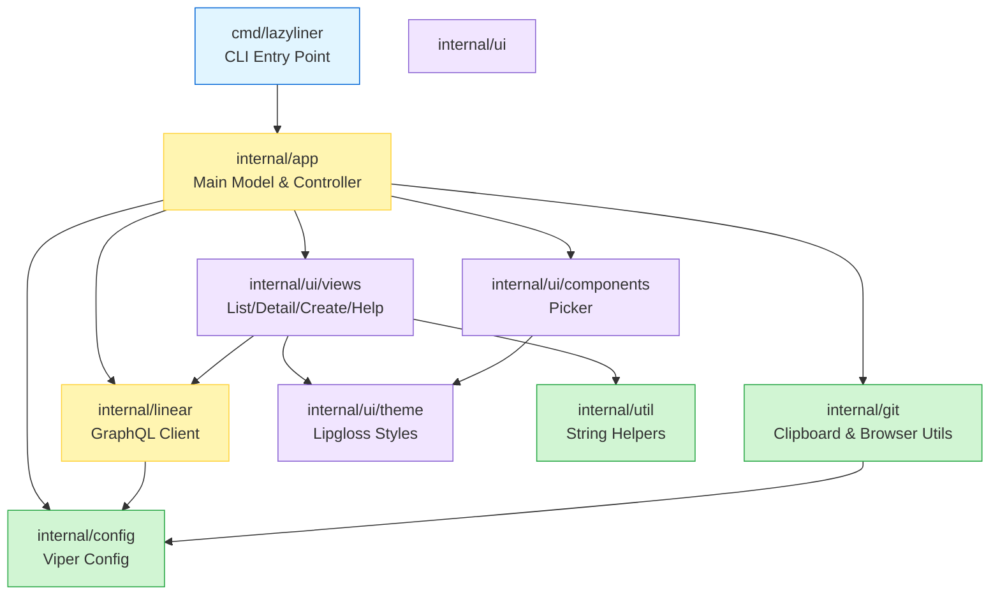
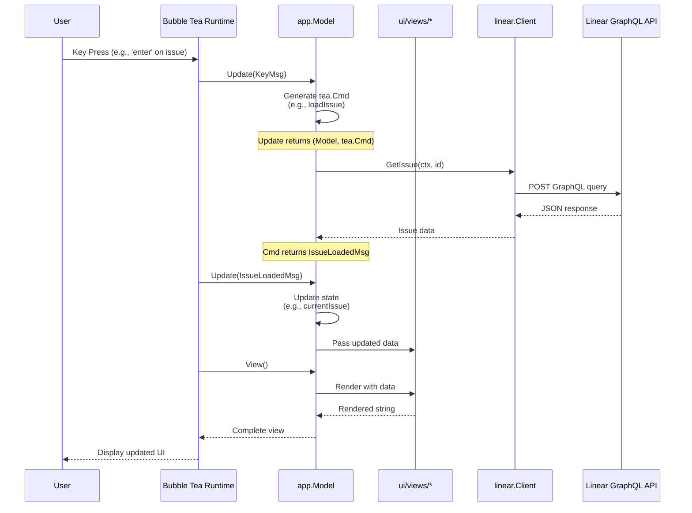
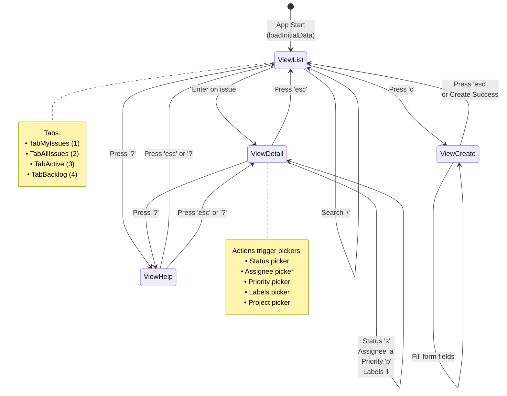

# CLAUDE.md

This file provides guidance to Claude Code (claude.ai/code) when working with code in this repository.

## Build & Development Commands

```bash
make build          # Build binary to bin/lazyliner
make run            # Run in development mode
make test           # Run all tests
make lint           # Run golangci-lint (auto-installs if missing)
make fmt            # Format code with gofmt -s
make tidy           # go mod tidy
make dev            # Hot-reload dev mode (uses air)

# Run single test
go test -v ./internal/linear -run TestGetIssues

# Test with coverage
make test-coverage  # Generates coverage.html
```

## Architecture Overview

This is a Go TUI application for Linear using Bubble Tea. The architecture follows a clear separation:

### Entry Points
- **CLI**: `cmd/lazyliner/main.go` - Cobra commands (`lazyliner`, `lazyliner list`, `lazyliner view <id>`, `lazyliner create`)
- **TUI**: `internal/app/app.go` - Main Bubble Tea model that orchestrates all views

### Core Data Flow
1. **Model-driven views**: `app.Model` manages `ViewList`, `ViewDetail`, `ViewCreate`, `ViewHelp` and tabs (`TabMyIssues`, `TabAllIssues`, `TabActive`, `TabBacklog`)
2. **Async operations**: Commands return typed messages (e.g., `loadIssues()` returns `IssuesLoadedMsg`); `Update()` consumes messages and updates state
3. **Message types**: Defined in `internal/app/messages.go`

### Package Structure
```
internal/
  app/           # Main Model, Update/View, keymaps, message types
  config/        # Viper config (~/.config/lazyliner/config.yaml)
  git/           # Clipboard, browser, git utilities
  linear/        # GraphQL API client
    client.go    # HTTP client with execute()
    queries.go   # Read operations (GetIssues, GetTeams, etc.)
    mutations.go # Write operations (UpdateIssueState, CreateIssue, etc.)
    types.go     # Data structures
  ui/
    components/  # Reusable components (picker)
    theme/       # Lipgloss styles (styles.go) and colors (colors.go)
    views/       # View models (issues/list, issues/detail, issues/create, help)
```

### Linear API Client
GraphQL queries use `Client.execute(ctx, query, vars, &result)` which handles auth and errors. Base URL: `https://api.linear.app/graphql`.

**Important**: Labels come as a connection (`Labels.Nodes` in raw results). The `convertIssues()` helper flattens these into `Issue.Labels`.

## Architecture Diagrams

### Component Relationship Diagram

This diagram shows how packages depend on each other:



### Data Flow Diagram

This diagram illustrates the flow from user input through Bubble Tea to the Linear API:



### View State Machine Diagram

This diagram shows how users navigate between different views:



### Message Flow Pattern

All async operations follow this pattern:

```
┌─────────────┐
│ User Action │ (e.g., press 'r' to refresh)
└──────┬──────┘
       │
       v
┌─────────────────┐
│  Update(KeyMsg) │ Match key binding
└──────┬──────────┘
       │
       v
┌──────────────────┐
│  Return tea.Cmd  │ (e.g., loadIssues)
└──────┬───────────┘
       │
       v
┌───────────────────┐
│ Cmd executes      │ Call Linear API
│ in goroutine      │ (async, non-blocking)
└──────┬────────────┘
       │
       v
┌────────────────────┐
│ Return typed Msg   │ (e.g., IssuesLoadedMsg)
└──────┬─────────────┘
       │
       v
┌────────────────────┐
│ Update(TypedMsg)   │ Update model state
└──────┬─────────────┘
       │
       v
┌────────────────────┐
│ View() renders     │ Display updated UI
└────────────────────┘
```

**Key Points:**
- All state changes go through `Update(msg tea.Msg)`
- Commands (`tea.Cmd`) run asynchronously and return messages
- Messages are type-safe structs defined in `internal/app/messages.go`
- Views are pure functions of model state (no side effects)

## Design Decisions

This section documents key architectural choices and their rationale.

### Why Bubble Tea Framework

**Decision**: Use [Bubble Tea](https://github.com/charmbracelet/bubbletea) as the TUI framework instead of alternatives like tview or termbox.

**Rationale**:
- **Elm Architecture**: Bubble Tea implements The Elm Architecture (Model-View-Update pattern), which provides a predictable, unidirectional data flow that makes complex state management easier to reason about
- **Type Safety**: Strong typing throughout the framework reduces runtime errors and makes refactoring safer
- **Composability**: Models can be easily composed and nested, allowing us to build complex UIs from simple, reusable components (see `internal/ui/views/` and `internal/ui/components/`)
- **Testing**: The pure functional approach (no side effects in `View()`, all state changes in `Update()`) makes the application easier to test
- **Ecosystem**: Integrates seamlessly with other Charm libraries like Lipgloss for styling and Bubbles for pre-built components

**Example**: The `app.Model` orchestrates multiple view models (`listView`, `detailView`, `createView`) and delegates update logic to each, keeping concerns separated.

### Message-Driven Architecture

**Decision**: All async operations and state changes flow through typed messages (defined in `internal/app/messages.go`).

**Rationale**:
- **Predictability**: Every state change has a clear, traceable path through the `Update()` function. You can always answer "how did we get here?" by looking at message handlers
- **Non-Blocking UI**: Long-running operations (API calls) execute in goroutines via `tea.Cmd` and return results as messages, preventing UI freezes
- **Type Safety**: Each message is a strongly-typed struct (e.g., `IssuesLoadedMsg`, `IssueUpdatedMsg`), eliminating string-based event systems and enabling compile-time checks
- **Debuggability**: Message flow can be logged or inspected at a single chokepoint (`Update()`), making debugging significantly easier
- **Decoupling**: Views and components don't need to know about each other—they communicate through messages, reducing coupling

**Example**: When a user refreshes issues:
```go
// User presses 'r' → Update() returns loadIssues() command
// loadIssues() calls API in goroutine → Returns IssuesLoadedMsg
// Update() receives IssuesLoadedMsg → Updates m.issues and m.listView
// View() renders with new data
```

This pattern eliminates callback hell and race conditions common in imperative UI frameworks.

### Package Structure Organization

**Decision**: Organize code into focused packages (`app`, `linear`, `ui`, `config`, `git`) with clear boundaries.

**Rationale**:
- **Single Responsibility**: Each package has one clear purpose:
  - `internal/app`: Application orchestration and main model
  - `internal/linear`: Linear API client (queries, mutations, types)
  - `internal/ui/views`: View-specific models and rendering logic
  - `internal/ui/components`: Reusable UI components (picker)
  - `internal/ui/theme`: Centralized styling with Lipgloss
  - `internal/config`: Configuration management with Viper
  - `internal/git`: System utilities (clipboard, browser)
- **Dependency Direction**: Dependencies flow inward (UI → App → Linear), preventing circular dependencies. Views depend on `linear` types but not vice versa
- **Testability**: Small, focused packages are easier to test in isolation. The `linear` package can be tested without importing UI code
- **Maintainability**: New features have clear homes. A new view goes in `ui/views/`, a new API method goes in `linear/queries.go` or `linear/mutations.go`

**Example**: The `picker` component in `internal/ui/components` is used by multiple views (status picker, assignee picker, labels picker) without duplication.

### GraphQL Client Approach

**Decision**: Use a custom, lightweight GraphQL client built on `net/http` rather than a generated client or heavy framework.

**Rationale**:
- **Simplicity**: The `execute()` method in `internal/linear/client.go` is ~60 lines and handles all GraphQL interactions. No code generation or complex tooling required
- **Flexibility**: Raw GraphQL queries in code are easy to read and modify. No abstraction layer to learn or fight against
- **Error Handling**: Centralized error handling in `execute()` ensures consistent behavior (auth errors, network errors, GraphQL errors) across all API calls
- **Type Safety**: While queries are strings, responses are unmarshaled into strongly-typed Go structs in `internal/linear/types.go`, giving us compile-time safety where it matters
- **Performance**: Only fetch the fields we need. Each query specifies exactly what data to retrieve, minimizing payload size
- **Maintainability**: When Linear's API changes, updates are localized to `queries.go` or `mutations.go`. No need to regenerate client code

**Example**: Adding a new query is straightforward:
```go
func (c *Client) GetLabels(ctx context.Context, teamID string) ([]Label, error) {
    query := `
        query GetLabels($teamId: String!) {
            team(id: $teamId) {
                labels { nodes { id name color } }
            }
        }
    `
    var result struct {
        Team struct {
            Labels struct { Nodes []Label } `json:"labels"`
        } `json:"team"`
    }
    if err := c.execute(ctx, query, map[string]interface{}{"teamId": teamID}, &result); err != nil {
        return nil, err
    }
    return result.Team.Labels.Nodes, nil
}
```

No code generation, no schema files, just plain Go.

## Code Conventions

### Import Order
```go
import (
    "context"                                          // stdlib first

    "github.com/brandonli/lazyliner/internal/config"   // internal second

    tea "github.com/charmbracelet/bubbletea"           // external third (alias tea)
)
```

### Naming
- Packages: lowercase, single word (`linear`, `theme`)
- Exported types/funcs: PascalCase (`IssueCreateInput`, `GetIssues`)
- Private funcs: camelCase (`buildFilter`)
- JSON tags: snake_case (`json:"branch_name"`)
- Config tags: snake_case (`mapstructure:"api_key"`)

### Enums
```go
type View int
const (
    ViewList View = iota
    ViewDetail
    ViewCreate
)
```

### Error Handling
Always wrap with context and check nullable fields:
```go
if err != nil {
    return nil, fmt.Errorf("failed to fetch issues: %w", err)
}
status := "Unknown"
if issue.State != nil {
    status = issue.State.Name
}
```

## Adding Features

This section provides detailed, step-by-step examples for adding new functionality to Lazyliner.

### Adding a New CLI Command

CLI commands use the [Cobra](https://github.com/spf13/cobra) framework. All CLI commands are defined in `cmd/lazyliner/main.go`.

**Example: Adding a `lazyliner search <query>` command**

```go
// 1. Define the command struct
var searchCmd = &cobra.Command{
    Use:   "search [query]",
    Short: "Search for issues by text",
    Args:  cobra.ExactArgs(1),
    RunE:  runSearch,
}

// 2. Add flags (optional)
var (
    searchLimit int
    searchTeam  string
)

// 3. Initialize flags and register command
func init() {
    searchCmd.Flags().IntVarP(&searchLimit, "limit", "n", 10, "Max results")
    searchCmd.Flags().StringVarP(&searchTeam, "team", "t", "", "Filter by team")

    rootCmd.AddCommand(searchCmd)
}

// 4. Implement the command handler
func runSearch(cmd *cobra.Command, args []string) error {
    if err := requireAPIKey(); err != nil {
        return err
    }

    client := linear.NewClient(cfg.Linear.APIKey)
    ctx := context.Background()

    // Build filter based on flags
    filter := linear.IssueFilter{
        Query: args[0],
        Limit: searchLimit,
    }
    if searchTeam != "" {
        filter.TeamID = searchTeam
    }

    issues, err := client.GetIssues(ctx, filter)
    if err != nil {
        return fmt.Errorf("search failed: %w", err)
    }

    // Format output (use tabwriter for clean tables)
    w := tabwriter.NewWriter(os.Stdout, 0, 0, 2, ' ', 0)
    fmt.Fprintln(w, "ID\tTITLE\tSTATUS")
    fmt.Fprintln(w, "──\t─────\t──────")

    for _, issue := range issues {
        status := "Unknown"
        if issue.State != nil {
            status = issue.State.Name
        }
        fmt.Fprintf(w, "%s\t%s\t%s\n",
            issue.Identifier,
            util.Truncate(issue.Title, 50),
            status,
        )
    }
    w.Flush()

    fmt.Printf("\nFound %d issues\n", len(issues))
    return nil
}
```

**Key patterns:**
- Use `cobra.ExactArgs(n)` for required positional arguments
- Use `cobra.MinimumNArgs(n)` or `cobra.MaximumArgs(n)` for flexible args
- Always call `requireAPIKey()` before API operations
- Use `fmt.Errorf("...: %w", err)` to wrap errors with context
- Use `tabwriter.Writer` for clean column-aligned output
- Return errors (don't call `os.Exit()` directly in `RunE`)

### Adding a New Linear API Method

API methods go in `internal/linear/queries.go` (reads) or `internal/linear/mutations.go` (writes).

#### Adding a Query (Read Operation)

**Example: Adding `GetComments(ctx, issueID)` method**

```go
// 1. Define types in internal/linear/types.go
type Comment struct {
    ID        string    `json:"id"`
    Body      string    `json:"body"`
    CreatedAt time.Time `json:"createdAt"`
    UpdatedAt time.Time `json:"updatedAt"`
    User      *User     `json:"user,omitempty"`
}

// 2. Add query method in internal/linear/queries.go
func (c *Client) GetComments(ctx context.Context, issueID string) ([]Comment, error) {
    query := `
        query GetComments($issueId: String!) {
            issue(id: $issueId) {
                comments {
                    nodes {
                        id
                        body
                        createdAt
                        updatedAt
                        user {
                            id
                            name
                            displayName
                            email
                        }
                    }
                }
            }
        }
    `

    variables := map[string]interface{}{
        "issueId": issueID,
    }

    var result struct {
        Issue struct {
            Comments struct {
                Nodes []Comment `json:"nodes"`
            } `json:"comments"`
        } `json:"issue"`
    }

    if err := c.execute(ctx, query, variables, &result); err != nil {
        return nil, fmt.Errorf("failed to get comments: %w", err)
    }

    return result.Issue.Comments.Nodes, nil
}
```

**Key patterns:**
- Always wrap results: nested structs mirror GraphQL response structure
- Connection types use `Nodes []T` (Linear's pagination pattern)
- Use `interface{}` for variables (execute() handles JSON marshaling)
- Always wrap errors with descriptive context
- Nullable fields must use pointer types (`*User`, `*State`)

#### Adding a Mutation (Write Operation)

**Example: Adding `AddComment(ctx, issueID, body)` method**

```go
// 1. Define input type in internal/linear/types.go
type CommentCreateInput struct {
    IssueID string `json:"issueId"`
    Body    string `json:"body"`
}

// 2. Add mutation method in internal/linear/mutations.go
func (c *Client) AddComment(ctx context.Context, input CommentCreateInput) (*Comment, error) {
    mutation := `
        mutation CreateComment($issueId: String!, $body: String!) {
            commentCreate(input: {
                issueId: $issueId
                body: $body
            }) {
                success
                comment {
                    id
                    body
                    createdAt
                    user {
                        id
                        name
                        displayName
                    }
                }
            }
        }
    `

    variables := map[string]interface{}{
        "issueId": input.IssueID,
        "body":    input.Body,
    }

    var result struct {
        CommentCreate struct {
            Success bool     `json:"success"`
            Comment *Comment `json:"comment"`
        } `json:"commentCreate"`
    }

    if err := c.execute(ctx, mutation, variables, &result); err != nil {
        return nil, fmt.Errorf("failed to create comment: %w", err)
    }

    if !result.CommentCreate.Success {
        return nil, fmt.Errorf("comment creation failed")
    }

    return result.CommentCreate.Comment, nil
}
```

**Key patterns:**
- Mutations return `{ success, <entity> }` structs
- Always check `success` field before returning
- Input types use `Input` suffix by convention
- Mutations use `mutation` keyword (not `query`)
- Variable names match GraphQL schema conventions (camelCase)

### Adding a New Keybinding

Keybindings are centralized in `internal/app/keymap.go`.

**Example: Adding a "Toggle Archive" keybinding (Ctrl+A)**

```go
// 1. Add to KeyMap struct in keymap.go
type KeyMap struct {
    // ... existing fields ...

    // Archive actions
    ToggleArchive key.Binding
}

// 2. Add to DefaultKeyMap() function
func DefaultKeyMap() KeyMap {
    return KeyMap{
        // ... existing bindings ...

        ToggleArchive: key.NewBinding(
            key.WithKeys("ctrl+a"),
            key.WithHelp("ctrl+a", "toggle archive"),
        ),
    }
}

// 3. Handle in the appropriate view's Update() function
// For example, in internal/ui/views/issues/detail/detail.go:

func (m Model) Update(msg tea.Msg) (Model, tea.Cmd) {
    switch msg := msg.(type) {
    case tea.KeyMsg:
        // Handle the new keybinding
        if key.Matches(msg, m.keymap.ToggleArchive) {
            return m, m.toggleArchive()
        }

        // ... other key handlers ...
    }

    // ... rest of Update() ...
}

// 4. Implement the command function
func (m Model) toggleArchive() tea.Cmd {
    return func() tea.Msg {
        ctx := context.Background()

        // Call API mutation
        err := m.client.ArchiveIssue(ctx, m.issue.ID, !m.issue.Archived)
        if err != nil {
            return IssueArchivedMsg{Err: err}
        }

        return IssueArchivedMsg{Success: true}
    }
}
```

**Key patterns:**
- Use `key.Matches(msg, binding)` to check if key was pressed
- Commands return `tea.Msg` (typed message structs)
- Long-running operations run in goroutines via `tea.Cmd`
- Multiple keys can map to same binding: `key.WithKeys("q", "ctrl+c")`
- Help text should be concise (shown in help view)

### Complete Worked Example: Adding "Star Issue" Feature

This example shows the full lifecycle of adding a feature that allows users to star/favorite issues.

#### Step 1: Add API Types

**File: `internal/linear/types.go`**

```go
// Add field to existing Issue struct
type Issue struct {
    ID         string    `json:"id"`
    // ... existing fields ...
    Starred    bool      `json:"starred"`     // NEW
}

// Add input type for mutation
type IssueStarInput struct {
    IssueID string `json:"issueId"`
    Starred bool   `json:"starred"`
}
```

#### Step 2: Add API Methods

**File: `internal/linear/queries.go`**

```go
// Update GetIssue query to include starred field
func (c *Client) GetIssue(ctx context.Context, idOrIdentifier string) (*Issue, error) {
    query := `
        query Issue($id: String!) {
            issue(id: $id) {
                id
                identifier
                title
                starred              # ADD THIS LINE
                # ... other fields ...
            }
        }
    `
    // ... rest of implementation unchanged ...
}

// Add method to get starred issues
func (c *Client) GetStarredIssues(ctx context.Context, limit int) ([]Issue, error) {
    if limit <= 0 {
        limit = 50
    }

    query := `
        query StarredIssues($limit: Int!) {
            viewer {
                starredIssues(first: $limit, orderBy: updatedAt) {
                    nodes {
                        id
                        identifier
                        title
                        starred
                        state { id name color type }
                        assignee { id name displayName }
                    }
                }
            }
        }
    `

    variables := map[string]interface{}{
        "limit": limit,
    }

    var result struct {
        Viewer struct {
            StarredIssues struct {
                Nodes []rawIssue `json:"nodes"`
            } `json:"starredIssues"`
        } `json:"viewer"`
    }

    if err := c.execute(ctx, query, variables, &result); err != nil {
        return nil, fmt.Errorf("failed to fetch starred issues: %w", err)
    }

    return convertIssues(result.Viewer.StarredIssues.Nodes), nil
}
```

**File: `internal/linear/mutations.go`**

```go
func (c *Client) UpdateIssueStar(ctx context.Context, issueID string, starred bool) error {
    mutation := `
        mutation UpdateIssueStar($issueId: String!, $starred: Boolean!) {
            issueUpdate(id: $issueId, input: { starred: $starred }) {
                success
                issue {
                    id
                    starred
                }
            }
        }
    `

    variables := map[string]interface{}{
        "issueId": issueID,
        "starred": starred,
    }

    var result struct {
        IssueUpdate struct {
            Success bool `json:"success"`
        } `json:"issueUpdate"`
    }

    if err := c.execute(ctx, mutation, variables, &result); err != nil {
        return fmt.Errorf("failed to update star: %w", err)
    }

    if !result.IssueUpdate.Success {
        return fmt.Errorf("star update was not successful")
    }

    return nil
}
```

#### Step 3: Add Message Types

**File: `internal/app/messages.go`**

```go
// Add new message type for star updates
type IssueStarredMsg struct {
    IssueID string
    Starred bool
    Err     error
}
```

#### Step 4: Add Keybinding

**File: `internal/app/keymap.go`**

```go
type KeyMap struct {
    // ... existing fields ...
    ToggleStar key.Binding
}

func DefaultKeyMap() KeyMap {
    return KeyMap {
        // ... existing bindings ...
        ToggleStar: key.NewBinding(
            key.WithKeys("*"),
            key.WithHelp("*", "toggle star"),
        ),
    }
}
```

#### Step 5: Wire Up in App Model

**File: `internal/app/app.go`**

```go
// Add command to load starred issues
func (m Model) loadStarredIssues() tea.Cmd {
    return func() tea.Msg {
        ctx := context.Background()
        issues, err := m.client.GetStarredIssues(ctx, 50)
        if err != nil {
            return IssuesLoadedMsg{Err: err}
        }
        return IssuesLoadedMsg{Issues: issues, Tab: TabStarred}
    }
}

// Add command to toggle star
func (m Model) toggleStar(issueID string, currentStar bool) tea.Cmd {
    return func() tea.Msg {
        ctx := context.Background()
        newStarred := !currentStar

        err := m.client.UpdateIssueStar(ctx, issueID, newStarred)
        if err != nil {
            return IssueStarredMsg{IssueID: issueID, Err: err}
        }

        return IssueStarredMsg{
            IssueID: issueID,
            Starred: newStarred,
        }
    }
}

// Handle messages in Update()
func (m Model) Update(msg tea.Msg) (tea.Model, tea.Cmd) {
    switch msg := msg.(type) {

    case IssueStarredMsg:
        if msg.Err != nil {
            m.err = msg.Err
            return m, nil
        }

        // Update local state
        if m.currentView == ViewDetail && m.currentIssue != nil {
            if m.currentIssue.ID == msg.IssueID {
                m.currentIssue.Starred = msg.Starred
            }
        }

        // Refresh list if we're showing starred issues
        if m.currentTab == TabStarred {
            return m, m.loadStarredIssues()
        }

        return m, nil

    // ... other message handlers ...
    }

    // ... rest of Update() ...
}
```

#### Step 6: Update Detail View

**File: `internal/ui/views/issues/detail/detail.go`**

```go
func (m Model) Update(msg tea.Msg) (Model, tea.Cmd) {
    switch msg := msg.(type) {
    case tea.KeyMsg:
        if key.Matches(msg, m.keymap.ToggleStar) {
            if m.issue != nil {
                return m, m.toggleStar()
            }
        }
        // ... other handlers ...
    }
    // ... rest of Update() ...
}

func (m Model) toggleStar() tea.Cmd {
    return func() tea.Msg {
        ctx := context.Background()
        newStarred := !m.issue.Starred

        err := m.client.UpdateIssueStar(ctx, m.issue.ID, newStarred)
        if err != nil {
            return IssueStarredMsg{Err: err}
        }

        return IssueStarredMsg{
            IssueID: m.issue.ID,
            Starred: newStarred,
        }
    }
}

func (m Model) View() string {
    if m.issue == nil {
        return "Loading..."
    }

    var b strings.Builder

    // Add star indicator
    starIcon := " "
    if m.issue.Starred {
        starIcon = "★"
    }
    b.WriteString(fmt.Sprintf("%s %s: %s\n\n",
        starIcon,
        m.issue.Identifier,
        m.issue.Title,
    ))

    // ... rest of view rendering ...

    return b.String()
}
```

#### Step 7: Add CLI Command (Optional)

**File: `cmd/lazyliner/main.go`**

```go
var starCmd = &cobra.Command{
    Use:   "star [issue-id]",
    Short: "Star or unstar an issue",
    Args:  cobra.ExactArgs(1),
    RunE:  runStar,
}

var unstar bool

func init() {
    starCmd.Flags().BoolVarP(&unstar, "unstar", "u", false, "Remove star")
    rootCmd.AddCommand(starCmd)
}

func runStar(cmd *cobra.Command, args []string) error {
    if err := requireAPIKey(); err != nil {
        return err
    }

    client := linear.NewClient(cfg.Linear.APIKey)
    ctx := context.Background()

    starred := !unstar

    if err := client.UpdateIssueStar(ctx, args[0], starred); err != nil {
        return fmt.Errorf("failed to update star: %w", err)
    }

    action := "starred"
    if unstar {
        action = "unstarred"
    }
    fmt.Printf("Issue %s %s\n", args[0], action)

    return nil
}
```

#### Step 8: Test the Feature

```bash
# Test API methods
go test -v ./internal/linear -run TestUpdateIssueStar

# Test the CLI command
make build
./bin/lazyliner star LIN-123
./bin/lazyliner star LIN-123 --unstar

# Test the TUI
make run
# Press 'enter' on an issue to view details
# Press '*' to toggle star
```

### Summary: Feature Addition Checklist

When adding a new feature, follow this checklist:

- [ ] **Define types** in `internal/linear/types.go`
- [ ] **Add API methods** in `queries.go` or `mutations.go`
- [ ] **Add message types** in `internal/app/messages.go`
- [ ] **Add keybindings** in `internal/app/keymap.go`
- [ ] **Wire commands** in `internal/app/app.go` Update()
- [ ] **Update views** in `internal/ui/views/*` to handle new functionality
- [ ] **Add CLI commands** in `cmd/lazyliner/main.go` (if applicable)
- [ ] **Write tests** for API methods and business logic
- [ ] **Update help view** if adding user-visible commands
- [ ] **Test manually** in both CLI and TUI modes

## Testing Guide

### Running Tests

```bash
# Run all tests
make test

# Run tests with coverage report
make test-coverage  # Generates coverage.out and coverage.html

# Run specific package tests
go test -v ./internal/linear

# Run specific test function
go test -v ./internal/linear -run TestGetIssues

# Run tests with race detection
go test -race ./...
```

### Test File Naming

Test files follow Go conventions:
- Test files end with `_test.go` (e.g., `client_test.go`)
- Place test files in the same package as the code they test
- Table-driven tests use descriptive struct field names

Example structure:
```
internal/linear/
├── client.go
├── client_test.go
├── queries.go
└── queries_test.go
```

### Test Structure

Follow this pattern for tests:

```go
package linear

import (
    "context"
    "testing"

    "github.com/stretchr/testify/assert"
    "github.com/stretchr/testify/require"
)

// Table-driven test example
func TestGetIssues(t *testing.T) {
    tests := []struct {
        name    string
        input   IssueFilter
        want    int
        wantErr bool
    }{
        {
            name:    "filter by assignee",
            input:   IssueFilter{AssigneeID: "user-123"},
            want:    5,
            wantErr: false,
        },
        {
            name:    "invalid filter",
            input:   IssueFilter{},
            want:    0,
            wantErr: true,
        },
    }

    for _, tt := range tests {
        t.Run(tt.name, func(t *testing.T) {
            // Setup
            client := NewClient("test-key")
            ctx := context.Background()

            // Execute
            got, err := client.GetIssues(ctx, tt.input)

            // Assert
            if tt.wantErr {
                require.Error(t, err)
                return
            }
            require.NoError(t, err)
            assert.Equal(t, tt.want, len(got))
        })
    }
}

// Simple test example
func TestNewListModel(t *testing.T) {
    issues := []Issue{{Title: "Test"}}
    m := NewListModel(issues, 100, 50)

    assert.Equal(t, 1, len(m.issues))
    assert.Equal(t, 0, m.cursor)
    assert.Equal(t, 48, m.pageSize) // height - 2
}
```

### Coverage Reporting

After running `make test-coverage`:
1. Open `coverage.html` in your browser to see visual coverage
2. Check `coverage.out` for raw coverage data
3. Aim for >80% coverage on business logic (API client, core models)
4. TUI views may have lower coverage (hard to test without mocks)

### Testing Best Practices

- **Use `require`** for assertions that must pass before continuing
- **Use `assert`** for non-critical assertions
- **Mock external dependencies**: Use interfaces for Linear API calls
- **Test error paths**: Ensure error handling works correctly
- **Table-driven tests**: Preferred for testing multiple scenarios
- **Parallel tests**: Use `t.Parallel()` when tests don't share state

## Release Process

### Semantic Versioning

This project follows [Semantic Versioning](https://semver.org/):
- **MAJOR** (vX.0.0): Breaking changes
- **MINOR** (v0.X.0): New features, backward compatible
- **PATCH** (v0.0.X): Bug fixes, backward compatible

### Creating a Release

1. **Prepare the release**:
   ```bash
   # Ensure all tests pass
   make test
   make lint

   # Build and verify locally
   make build
   ```

2. **Create and push a git tag**:
   ```bash
   # Create an annotated tag
   git tag -a v1.2.3 -m "Release 1.2.3"

   # Push the tag to trigger release workflow
   git push origin v1.2.3
   ```

3. **GoReleaser workflow**:

   The release process is automated with GoReleaser (`.goreleaser.yaml`):

   ```bash
   # Manual release (requires GoReleaser installed)
   goreleaser release

   # Test release locally without publishing
   goreleaser release --snapshot --clean
   ```

   GoReleaser automatically:
   - Builds binaries for multiple platforms (linux, darwin, windows)
   - Supports amd64 and arm64 architectures
   - Embeds version info via ldflags (`-X main.version={{.Version}}`)
   - Creates archives (`.tar.gz` for Unix, `.zip` for Windows)
   - Generates checksums (`checksums.txt`)
   - Creates packages (`.deb`, `.rpm`)
   - Publishes to GitHub Releases with auto-generated changelog

### Distribution Channels

- **GitHub Releases**: Primary distribution (https://github.com/brandonli/lazyliner/releases)
  - Binaries for all supported platforms
  - Checksums for verification
  - Auto-generated changelog

- **Homebrew**: macOS/Linux package manager
  ```bash
  brew tap brandonli/tap
  brew install lazyliner
  ```
  Formula maintained at: https://github.com/brandonli/homebrew-tap

- **Package Managers**:
  - Debian/Ubuntu: `.deb` packages
  - RedHat/Fedora: `.rpm` packages

### Manual Multi-Platform Build

For local testing without GoReleaser:

```bash
make release  # Builds for darwin/linux/windows (amd64 + arm64)
```

Outputs to `bin/`:
- `lazyliner-darwin-amd64`
- `lazyliner-darwin-arm64`
- `lazyliner-linux-amd64`
- `lazyliner-linux-arm64`
- `lazyliner-windows-amd64.exe`

## Environment & Config

| Variable | Description |
|----------|-------------|
| `LAZYLINER_API_KEY` | Linear API key (required) |
| `LINEAR_API_KEY` | Fallback API key |

Config file: `~/.config/lazyliner/config.yaml`

## Gotchas

- **Window sizing**: Views use `SetSize(width, height-4)` to reserve header/footer space; preserve this pattern
- **Search mode**: List view has a search input; ensure `textinput.Blink` when focusing
- **Labels connection**: Always access via `Labels.Nodes` in raw results; use `convertIssues()` to flatten
