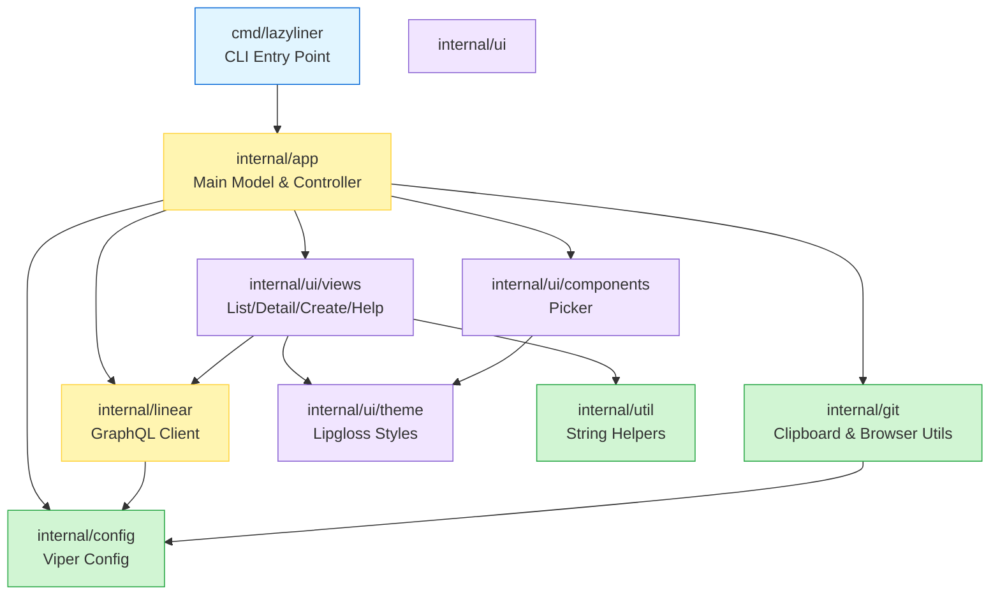
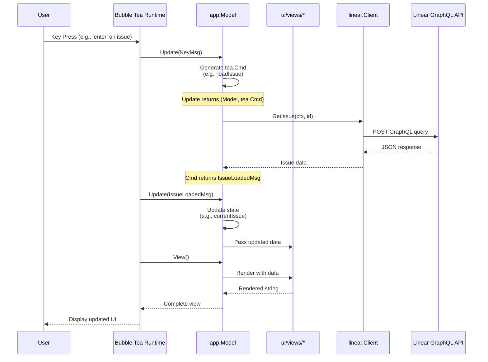
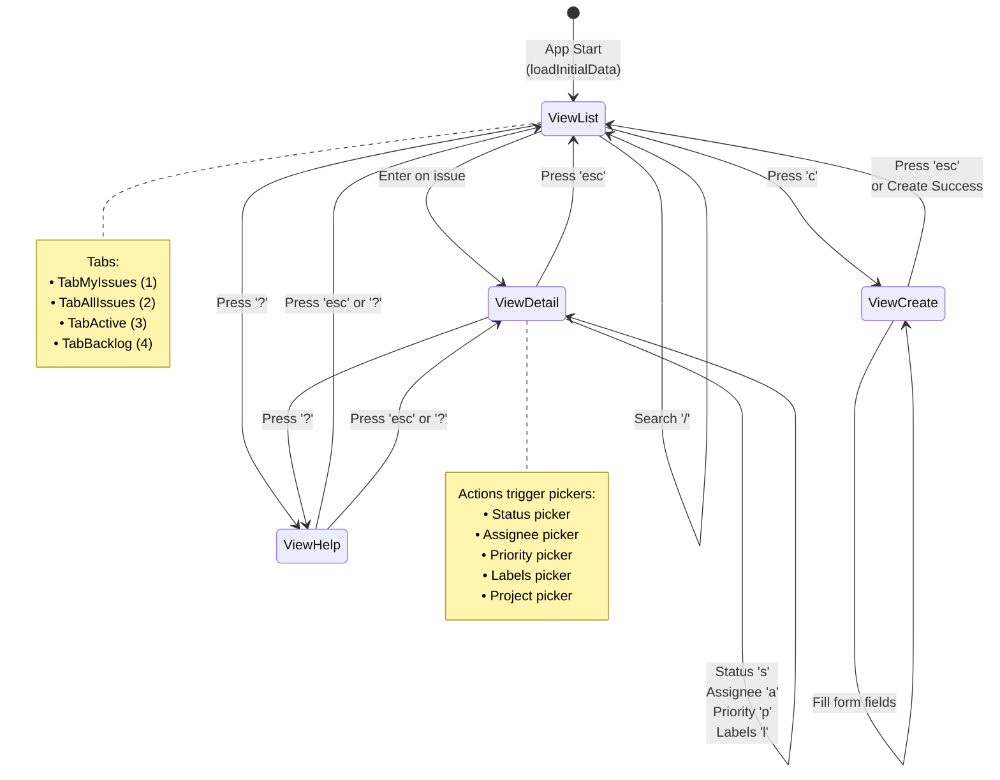

# CLAUDE.md

This file provides guidance to Claude Code (claude.ai/code) when working with code in this repository.

## Build & Development Commands

```bash
make build          # Build binary to bin/lazyliner
make run            # Run in development mode
make test           # Run all tests
make lint           # Run golangci-lint (auto-installs if missing)
make fmt            # Format code with gofmt -s
make tidy           # go mod tidy
make dev            # Hot-reload dev mode (uses air)

# Run single test
go test -v ./internal/linear -run TestGetIssues

# Test with coverage
make test-coverage  # Generates coverage.html
```

## Architecture Overview

This is a Go TUI application for Linear using Bubble Tea. The architecture follows a clear separation:

### Entry Points
- **CLI**: `cmd/lazyliner/main.go` - Cobra commands (`lazyliner`, `lazyliner list`, `lazyliner view <id>`, `lazyliner create`)
- **TUI**: `internal/app/app.go` - Main Bubble Tea model that orchestrates all views

### Core Data Flow
1. **Model-driven views**: `app.Model` manages `ViewList`, `ViewDetail`, `ViewCreate`, `ViewHelp` and tabs (`TabMyIssues`, `TabAllIssues`, `TabActive`, `TabBacklog`)
2. **Async operations**: Commands return typed messages (e.g., `loadIssues()` returns `IssuesLoadedMsg`); `Update()` consumes messages and updates state
3. **Message types**: Defined in `internal/app/messages.go`

### Package Structure
```
internal/
  app/           # Main Model, Update/View, keymaps, message types
  config/        # Viper config (~/.config/lazyliner/config.yaml)
  git/           # Clipboard, browser, git utilities
  linear/        # GraphQL API client
    client.go    # HTTP client with execute()
    queries.go   # Read operations (GetIssues, GetTeams, etc.)
    mutations.go # Write operations (UpdateIssueState, CreateIssue, etc.)
    types.go     # Data structures
  ui/
    components/  # Reusable components (picker)
    theme/       # Lipgloss styles (styles.go) and colors (colors.go)
    views/       # View models (issues/list, issues/detail, issues/create, help)
```

### Linear API Client
GraphQL queries use `Client.execute(ctx, query, vars, &result)` which handles auth and errors. Base URL: `https://api.linear.app/graphql`.

**Important**: Labels come as a connection (`Labels.Nodes` in raw results). The `convertIssues()` helper flattens these into `Issue.Labels`.

## Architecture Diagrams

### Component Relationship Diagram

This diagram shows how packages depend on each other:



### Data Flow Diagram

This diagram illustrates the flow from user input through Bubble Tea to the Linear API:



### View State Machine Diagram

This diagram shows how users navigate between different views:



### Message Flow Pattern

All async operations follow this pattern:

```
┌─────────────┐
│ User Action │ (e.g., press 'r' to refresh)
└──────┬──────┘
       │
       v
┌─────────────────┐
│  Update(KeyMsg) │ Match key binding
└──────┬──────────┘
       │
       v
┌──────────────────┐
│  Return tea.Cmd  │ (e.g., loadIssues)
└──────┬───────────┘
       │
       v
┌───────────────────┐
│ Cmd executes      │ Call Linear API
│ in goroutine      │ (async, non-blocking)
└──────┬────────────┘
       │
       v
┌────────────────────┐
│ Return typed Msg   │ (e.g., IssuesLoadedMsg)
└──────┬─────────────┘
       │
       v
┌────────────────────┐
│ Update(TypedMsg)   │ Update model state
└──────┬─────────────┘
       │
       v
┌────────────────────┐
│ View() renders     │ Display updated UI
└────────────────────┘
```

**Key Points:**
- All state changes go through `Update(msg tea.Msg)`
- Commands (`tea.Cmd`) run asynchronously and return messages
- Messages are type-safe structs defined in `internal/app/messages.go`
- Views are pure functions of model state (no side effects)

## Code Conventions

### Import Order
```go
import (
    "context"                                          // stdlib first

    "github.com/brandonli/lazyliner/internal/config"   // internal second

    tea "github.com/charmbracelet/bubbletea"           // external third (alias tea)
)
```

### Naming
- Packages: lowercase, single word (`linear`, `theme`)
- Exported types/funcs: PascalCase (`IssueCreateInput`, `GetIssues`)
- Private funcs: camelCase (`buildFilter`)
- JSON tags: snake_case (`json:"branch_name"`)
- Config tags: snake_case (`mapstructure:"api_key"`)

### Enums
```go
type View int
const (
    ViewList View = iota
    ViewDetail
    ViewCreate
)
```

### Error Handling
Always wrap with context and check nullable fields:
```go
if err != nil {
    return nil, fmt.Errorf("failed to fetch issues: %w", err)
}
status := "Unknown"
if issue.State != nil {
    status = issue.State.Name
}
```

## Adding Features

### New View
1. Create model in `internal/ui/views/`
2. Add enum value to `View` in `internal/app/app.go`
3. Handle in `Update()` and `View()` switch statements
4. Add navigation keybinding in `keymap.go`

### New API Method
1. Add types in `internal/linear/types.go`
2. Add query in `queries.go` or mutation in `mutations.go`
3. Add message type in `internal/app/messages.go`
4. Wire a `tea.Cmd` in `internal/app/app.go`

### New Keybinding
1. Add to `KeyMap` struct in `keymap.go`
2. Add to `DefaultKeyMap()` function
3. Handle in the appropriate view's update function

## Testing Guide

### Running Tests

```bash
# Run all tests
make test

# Run tests with coverage report
make test-coverage  # Generates coverage.out and coverage.html

# Run specific package tests
go test -v ./internal/linear

# Run specific test function
go test -v ./internal/linear -run TestGetIssues

# Run tests with race detection
go test -race ./...
```

### Test File Naming

Test files follow Go conventions:
- Test files end with `_test.go` (e.g., `client_test.go`)
- Place test files in the same package as the code they test
- Table-driven tests use descriptive struct field names

Example structure:
```
internal/linear/
├── client.go
├── client_test.go
├── queries.go
└── queries_test.go
```

### Test Structure

Follow this pattern for tests:

```go
package linear

import (
    "context"
    "testing"

    "github.com/stretchr/testify/assert"
    "github.com/stretchr/testify/require"
)

// Table-driven test example
func TestGetIssues(t *testing.T) {
    tests := []struct {
        name    string
        input   IssueFilter
        want    int
        wantErr bool
    }{
        {
            name:    "filter by assignee",
            input:   IssueFilter{AssigneeID: "user-123"},
            want:    5,
            wantErr: false,
        },
        {
            name:    "invalid filter",
            input:   IssueFilter{},
            want:    0,
            wantErr: true,
        },
    }

    for _, tt := range tests {
        t.Run(tt.name, func(t *testing.T) {
            // Setup
            client := NewClient("test-key")
            ctx := context.Background()

            // Execute
            got, err := client.GetIssues(ctx, tt.input)

            // Assert
            if tt.wantErr {
                require.Error(t, err)
                return
            }
            require.NoError(t, err)
            assert.Equal(t, tt.want, len(got))
        })
    }
}

// Simple test example
func TestNewListModel(t *testing.T) {
    issues := []Issue{{Title: "Test"}}
    m := NewListModel(issues, 100, 50)

    assert.Equal(t, 1, len(m.issues))
    assert.Equal(t, 0, m.cursor)
    assert.Equal(t, 48, m.pageSize) // height - 2
}
```

### Coverage Reporting

After running `make test-coverage`:
1. Open `coverage.html` in your browser to see visual coverage
2. Check `coverage.out` for raw coverage data
3. Aim for >80% coverage on business logic (API client, core models)
4. TUI views may have lower coverage (hard to test without mocks)

### Testing Best Practices

- **Use `require`** for assertions that must pass before continuing
- **Use `assert`** for non-critical assertions
- **Mock external dependencies**: Use interfaces for Linear API calls
- **Test error paths**: Ensure error handling works correctly
- **Table-driven tests**: Preferred for testing multiple scenarios
- **Parallel tests**: Use `t.Parallel()` when tests don't share state

## Release Process

### Semantic Versioning

This project follows [Semantic Versioning](https://semver.org/):
- **MAJOR** (vX.0.0): Breaking changes
- **MINOR** (v0.X.0): New features, backward compatible
- **PATCH** (v0.0.X): Bug fixes, backward compatible

### Creating a Release

1. **Prepare the release**:
   ```bash
   # Ensure all tests pass
   make test
   make lint

   # Build and verify locally
   make build
   ```

2. **Create and push a git tag**:
   ```bash
   # Create an annotated tag
   git tag -a v1.2.3 -m "Release 1.2.3"

   # Push the tag to trigger release workflow
   git push origin v1.2.3
   ```

3. **GoReleaser workflow**:

   The release process is automated with GoReleaser (`.goreleaser.yaml`):

   ```bash
   # Manual release (requires GoReleaser installed)
   goreleaser release

   # Test release locally without publishing
   goreleaser release --snapshot --clean
   ```

   GoReleaser automatically:
   - Builds binaries for multiple platforms (linux, darwin, windows)
   - Supports amd64 and arm64 architectures
   - Embeds version info via ldflags (`-X main.version={{.Version}}`)
   - Creates archives (`.tar.gz` for Unix, `.zip` for Windows)
   - Generates checksums (`checksums.txt`)
   - Creates packages (`.deb`, `.rpm`)
   - Publishes to GitHub Releases with auto-generated changelog

### Distribution Channels

- **GitHub Releases**: Primary distribution (https://github.com/brandonli/lazyliner/releases)
  - Binaries for all supported platforms
  - Checksums for verification
  - Auto-generated changelog

- **Homebrew**: macOS/Linux package manager
  ```bash
  brew tap brandonli/tap
  brew install lazyliner
  ```
  Formula maintained at: https://github.com/brandonli/homebrew-tap

- **Package Managers**:
  - Debian/Ubuntu: `.deb` packages
  - RedHat/Fedora: `.rpm` packages

### Manual Multi-Platform Build

For local testing without GoReleaser:

```bash
make release  # Builds for darwin/linux/windows (amd64 + arm64)
```

Outputs to `bin/`:
- `lazyliner-darwin-amd64`
- `lazyliner-darwin-arm64`
- `lazyliner-linux-amd64`
- `lazyliner-linux-arm64`
- `lazyliner-windows-amd64.exe`

## Environment & Config

| Variable | Description |
|----------|-------------|
| `LAZYLINER_API_KEY` | Linear API key (required) |
| `LINEAR_API_KEY` | Fallback API key |

Config file: `~/.config/lazyliner/config.yaml`

## Gotchas

- **Window sizing**: Views use `SetSize(width, height-4)` to reserve header/footer space; preserve this pattern
- **Search mode**: List view has a search input; ensure `textinput.Blink` when focusing
- **Labels connection**: Always access via `Labels.Nodes` in raw results; use `convertIssues()` to flatten
